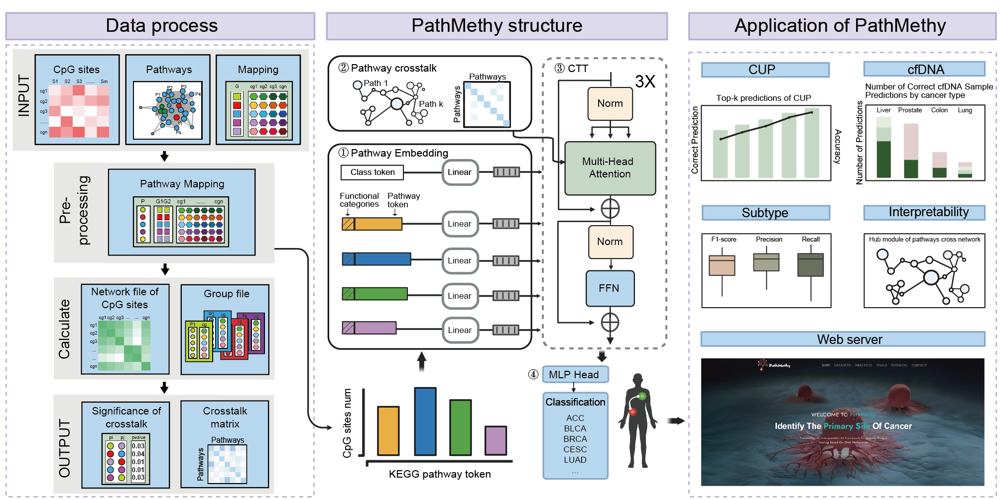

# Overview of PathMethy

## PathMethy: an interpretable AI framework for cancer origin tracing based on DNA methylation 


Despite advanced diagnostics, 3-5% of cases remain classified as cancer of unknown primary (CUP). DNA methylation, an important epigenetic feature, is essential for determining the origin of metastatic tumors. We presented PathMethy, a novel Transformer model integrated with functional categories and crosstalk of pathways, to accurately tracing the origin of tumors in CUPs based on DNA methylation. PathMethy outperformed seven competing methods in F1-score across nine cancer datasets and predicted accurately the molecular subtypes within 9 primary tumor types. It not only excelled at tracing the origins of both primary and metastatic tumors, but also demonstrated a high degree of agreement with previously diagnosed sites in cases of CUP. PathMethy provided biological insights by highlighting key pathways, functional categories and their interactions. Using functional categories of pathways, we gained a global understanding of biological processes. For broader access, a user-friendly web server for researchers and clinicians is available at https://cup.bpformer.com/index/.

# 🚀 Installation

```sh
git clone https://github.com/Kodp/PathMethy.git
conda create -n PathMethy python=3.10
conda activate PathMethy
pip install --requirement requirements.txt
```

The model is too large to be directly uploaded to GitHub, so we use Git LFS for the upload. You can use two methods to obtain the model and test data:

**Git LFS**

🔗 Install from the official website: [Git Large File Storage](https://git-lfs.github.com/)

or

```sh
sudo apt-get install git-lfs  
```

After installing Git LFS and cloning the repository, run:

```sh
git lfs pull
```

This command will automatically download the model and test data. It will download three files:

```
MODEL/model.pth.tar
data/cor_matrix50.csv
data/test_data.pkl
```

> Hint. If you just git clone the repo, the above three files will only generate placeholders, not the files themselves.

**Baidu**

link: https://pan.baidu.com/s/1WVSmzfc0M8U_AVhPO3ZhNA?pwd=t54k
code: t54k

## 🏃‍♂️ Run

**Example run:**

```python
python3 main.py ./configs/example.yaml  
```

The YAML file contains the experiment configuration. You can customize your experiment by using this config. Check the comments in `example.yaml` to know how to do it.

Each experiment's files are located in the `experiments` directory. The name of each subdirectory is the experiment name, which is configured in the YAML file under the `.exp_name` key.


